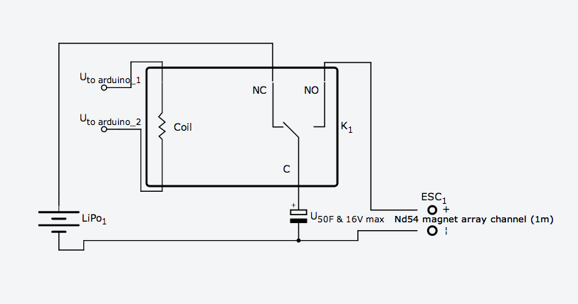

## Ultracapacitor -- Raw Current Method

Lorentz's law has that `F = I L x B`, so if we were able to create

`x`amps of current over 1 meter, with 1.3 Teslas (approximate B-Field of Nd54),

then we would cretea `x` newtons of force on the water inside.

**The Strategy** is to dump as much current through our high magnetic field channel to the order of magnitude of water displacement.

### Circuit Diagram

[link](http://123d.circuits.io/circuits/118750-supercapacitor-driven-open-magnetohydrodynamic-driver_v0-0/embed)
